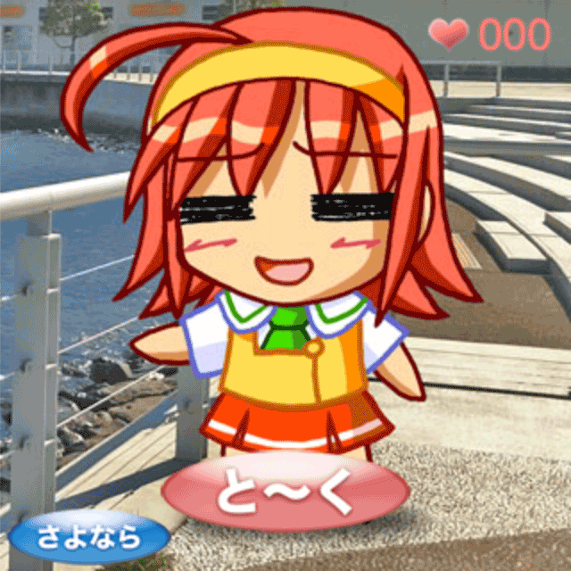
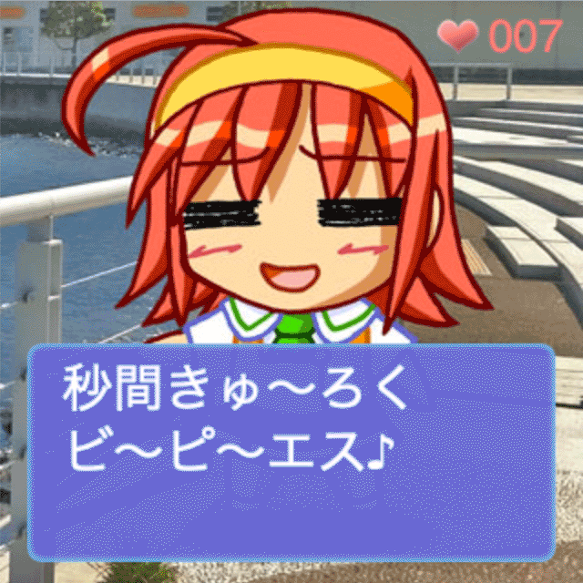
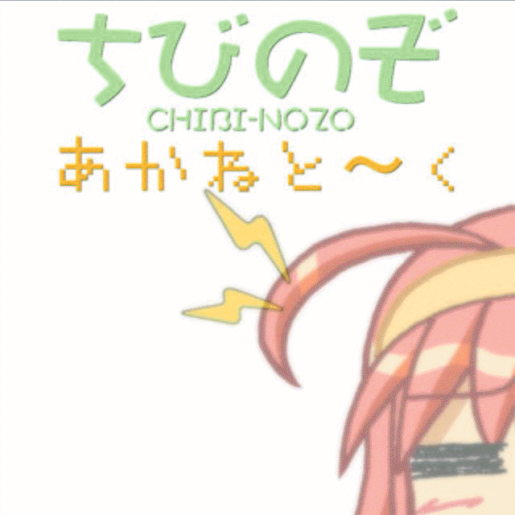
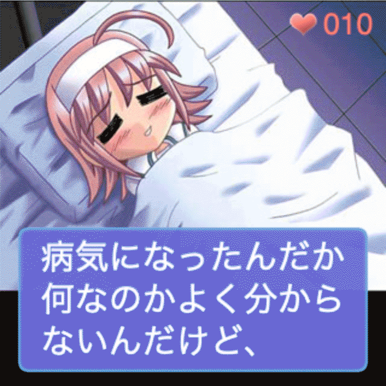

# あかねと〜く

## ★お兄ちゃん! いっしょに おはなし しよ♪

あかねちゃん は はるかちゃん の妹の女の子。
ふたりともきんじょに住んでいる“お兄ちゃん”が大好き。
最近は、 ヲタク なことに興味津
“お兄ちゃん”にいろいろ教えてもらっています。
そんなある日、 あかねちゃん は“お兄ちゃん”と
いっしょに おはなし することになりました。
季節は夏風味。
夏休み中風味なので、時間はたっぷりあります。
さてさて、どんな楽しい おはなし になるのでしょう?

## ★「あかねと〜く」ってなぁに?
2002年、DoCoMo503iで登場したちょっぴりアレなアプリが、皆様の思い出補整を補うべく超高画質になって再登場!
※トーク内容はオリジナルを完全移植しておりますので、古き良き当時の時事ネタをご堪能ください。
 
 

# **目次**
- [**プレビュー**](index.html)
- [**スクリプト仕様書**](docs/script.md)
- [**GPT-2のファインチューニング用のデータセット**](docs/dataset.txt)
 
 

# **ライセンス**
- [**MIT License**](LICENSE)